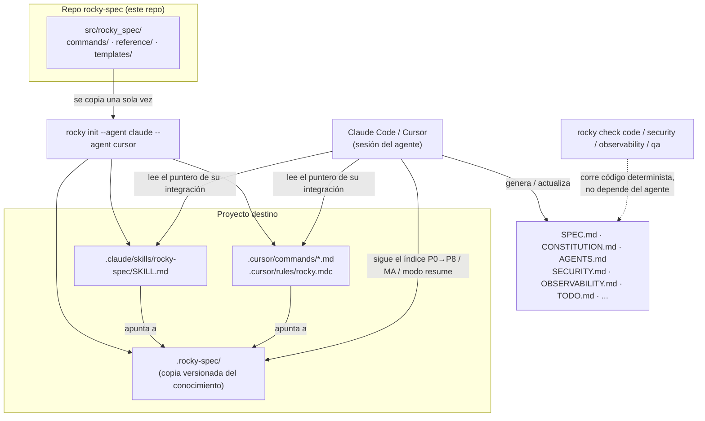

# rocky-spec

Toolkit multi-agente para **Spec-Driven Development**, nivel **Spec-Anchored** (el spec es un documento vivo, no una foto del día 1 — ver `src/rocky_spec/reference/methodologies.md`).

Nacido como una skill de Claude, ahora es un framework agnóstico de agente: la misma base de conocimiento (`.rocky-spec/`) sirve para Claude Code, Cursor, y los agentes que se agreguen — sin duplicar contenido entre ellos.

## Dos nombres, y por qué son distintos

| Nombre | Qué es | Dónde vive |
|---|---|---|
| **`rocky`** | El comando que se tipea en la terminal una vez instalado el paquete | `[project.scripts]` en `pyproject.toml` |
| **`rocky-spec`** | El nombre de **todo lo demás**: el paquete pip/PyPI, la skill original con la que se desarrolla este framework, y la skill que `rocky init --agent claude` genera **dentro de cada proyecto destino** | Paquete → este repo. Skill original → `~/.claude/skills/rocky-spec/`. Skill generada → `.claude/skills/rocky-spec/SKILL.md` de cada proyecto, invocable ahí como `/rocky-spec` |

Antes del rename (`charless` → `rocky-spec`) había una tercera variante — la skill original se llamaba `charless-ia`, distinta del paquete `spec-charless` — para dejar claro que una construye a la otra. Ese matiz ya no aplica: ambas se llaman `rocky-spec` ahora. La única diferencia real que queda es el **comando** (`rocky`, corto para tipear) vs. **todo el resto del framework** (`rocky-spec`, el nombre completo).

## Instalación

Requiere **Python 3.9 o superior**. No hace falta clonar el repo ni compilar nada: `pip` sabe instalar directamente desde GitHub.

### Recomendado — como herramienta aislada (`uv` o `pipx`)

Instala `rocky` en su propio entorno y lo deja disponible en el PATH, sin ensuciar tu Python del sistema. Mismo comando en **Windows, Linux y macOS**:

```bash
uv tool install git+https://github.com/carlos0718/rocky-spec.git
# o, si preferís pipx:
pipx install git+https://github.com/carlos0718/rocky-spec.git
```

**¿No tenés `uv` o `pipx` todavía?** Ninguno de los dos viene instalado por default — hace falta instalarlos primero:

<details>
<summary><b>Instalar uv</b></summary>

```powershell
# Windows (PowerShell)
powershell -ExecutionPolicy ByPass -c "irm https://astral.sh/uv/install.ps1 | iex"
```

```bash
# macOS / Linux
curl -LsSf https://astral.sh/uv/install.sh | sh
# o, si ya tenés Python: pip install uv
```

Detalle y otros métodos (Homebrew, Scoop, etc.) en la [guía oficial](https://docs.astral.sh/uv/getting-started/installation/).
</details>

<details>
<summary><b>Instalar pipx</b></summary>

```powershell
# Windows
py -m pip install --user pipx
.\pipx.exe ensurepath
```

```bash
# macOS
brew install pipx
pipx ensurepath
```

```bash
# Linux (Ubuntu/Debian con apt, o vía pip en el resto)
sudo apt install pipx  # o: python3 -m pip install --user pipx
pipx ensurepath
```

Detalle en la [guía oficial](https://pipx.pypa.io/latest/how-to/install-pipx.html).
</details>

**Reiniciá la terminal después de instalar `uv`/`pipx`** — el comando de instalación agrega su carpeta al PATH, pero la sesión actual de la terminal no se entera hasta que la reabrís.

> **Si `rocky --version` da "no se reconoce como comando" después de instalar**: el ejecutable se instaló bien (podés verificarlo con `uv tool list` / `pipx list`), pero su carpeta todavía no está en el PATH de la sesión actual. Corré `uv tool update-shell` (o `pipx ensurepath` si usaste pipx) y **reabrí la terminal** — es un paso aparte que no se hace solo durante el `install`.

### Fijar una versión

Sin sufijo, los comandos de arriba instalan la punta de `master`, que puede moverse entre una instalación y otra. Para reproducibilidad, agregá `@` y el tag de la versión:

```bash
uv tool install "git+https://github.com/carlos0718/rocky-spec.git@v0.7.0"
```

Las versiones publicadas están en [Releases](https://github.com/carlos0718/rocky-spec/releases), con sus notas en el [CHANGELOG](CHANGELOG.md).

> **Ojo con los tags anteriores a `v0.7.0`**: este proyecto se llamó `spec-charless` (comando `charless`) hasta esa versión. Fijar un tag más viejo (`@v0.6.1` o anterior) instala el paquete con el nombre viejo, no `rocky-spec` — ver el [CHANGELOG](CHANGELOG.md) para el detalle del rename.
>
> **¿Ya tenías `spec-charless` instalado?** No hay alias de compatibilidad — desinstalá el paquete viejo antes de instalar el nuevo, si no vas a terminar con `charless` y `rocky` conviviendo:
> ```bash
> uv tool uninstall spec-charless    # o: pipx uninstall spec-charless
> ```

### Alternativa — con `pip` en un entorno virtual

<details>
<summary><b>Windows</b> (PowerShell)</summary>

```powershell
py -m venv .venv
.venv\Scripts\Activate.ps1
py -m pip install git+https://github.com/carlos0718/rocky-spec.git
```
</details>

<details>
<summary><b>Linux / macOS</b></summary>

```bash
python3 -m venv .venv
source .venv/bin/activate
python3 -m pip install "git+https://github.com/carlos0718/rocky-spec.git"
```
</details>

> En Linux y macOS instalar con `pip` fuera de un entorno virtual suele fallar con `externally-managed-environment` — es una protección del sistema operativo, no un error del paquete. Usá `uv`/`pipx` o un venv.

Verificá que quedó bien:

```bash
rocky --version
rocky list-integrations
```

### Actualizar y desinstalar

```bash
uv tool upgrade rocky-spec      # o: pipx upgrade rocky-spec
uv tool uninstall rocky-spec    # o: pipx uninstall rocky-spec
```

Con `pip`, reinstalá agregando `--force-reinstall` al comando de instalación.

### Para desarrollar sobre la herramienta

```bash
git clone https://github.com/carlos0718/rocky-spec.git
cd rocky-spec
pip install -e ".[dev]"
pytest
```

> **Nota:** todavía no está publicado en PyPI, así que `pip install rocky-spec` (sin la URL de git) no funciona. Se instala desde el repo con los comandos de arriba.

## Uso

```bash
# Inicializar un proyecto con uno o más agentes
rocky init mi-proyecto --agent claude
rocky init mi-proyecto --agent claude --agent cursor

# Ver qué agentes soporta esta versión
rocky list-integrations

# Health-checks deterministas (no dependen de que un LLM corra el comando bien)
rocky check code .
rocky check security .
rocky check observability .
rocky check qa .
```

### Comandos disponibles

| Comando | Qué hace |
|---|---|
| `rocky` | Sin subcomando: muestra el banner de bienvenida (estado del proyecto si ya tiene `.rocky-spec/`, o la lista de agentes si es la primera vez) y la ayuda. |
| `rocky --version` | Imprime la versión instalada, leída de los metadatos del paquete. |
| `rocky commands` | Esta misma tabla, renderizada en la terminal. |
| `rocky init [PATH] --agent <agente>` | Instala el conocimiento compartido (`.rocky-spec/`) en `PATH` (default: `.`) y genera la integración de cada `--agent` (repetible: `--agent claude --agent cursor`). |
| `rocky init [PATH] --agent <agente> --force` | Igual que arriba, pero regenera `.rocky-spec/` aunque ya exista. |
| `rocky build [PATH] --values <json> [--force]` | Renderiza `SPEC.md`, `CONSTITUTION.md`, `AGENTS.md`, `CLAUDE.md`, `SECURITY.md`, `OBSERVABILITY.md`, `CHANGELOG.md`, `README.md`, `TODO.md` y `LICENSE` desde `.rocky-spec/templates/` a partir de un JSON de valores — no pisa archivos existentes salvo `--force`. |
| `rocky build [PATH] --values <json> --template <t> --output <ruta> [--force]` | Modo single-file: renderiza un solo template (ej. `MASTER.md.template`, `ACCESSIBILITY.md.template`) en vez del set fijo de arriba — `--template` y `--output` van juntos. |
| `rocky list-integrations` | Lista los agentes soportados por esta versión (`claude`, `cursor`). |
| `rocky check code [PATH]` | Health-check: tamaño de archivo y code smells estructurales. |
| `rocky check security [PATH]` | Health-check: `.env` commiteado, secrets hardcodeados, vulnerabilidades conocidas. |
| `rocky check observability [PATH]` | Health-check: error tracking, health endpoint, logging estructurado. |
| `rocky check qa [PATH]` | Trazabilidad RF → US → RNF → tarea y placeholders sin rellenar. |
| `rocky check version [PATH]` | Calcula el bump de SemVer exacto desde el último tag (Conventional Commits, "el más alto gana") y avisa si una rama `feature/*` acumuló demasiados `fix`. |
| `rocky check accessibility [PATH]` | Health-check: `alt`, `lang`, `div` clickeable sin rol, botón solo-ícono sin `aria-label`, contraste WCAG AA básico. |

`PATH` es opcional en todos los `check` — por default corre sobre el directorio actual (`.`).

## Cómo trabaja



**Cómo leerlo**: el conocimiento (`commands/`, `reference/`, `templates/`) vive una sola vez, en este repo. `rocky init` lo copia a `.rocky-spec/` dentro del proyecto destino y genera un puntero delgado por cada agente elegido — el agente (Claude Code, Cursor) lee ese puntero y de ahí sigue hacia `.rocky-spec/`, que es la fuente real de instrucciones. Los `rocky check` son código Python determinista que audita los archivos generados (`SPEC.md`, `SECURITY.md`, etc.) directamente, sin pasar por el agente.

Este diagrama es la mitad "empaquetado/instalación" del sistema. La otra mitad — qué pasos sigue el agente *dentro* de la conversación, con sus condicionales (¿tiene interfaz visual? ¿tiene backend? ¿es prototipo?) — está en [`src/rocky_spec/reference/flow-diagram.md`](src/rocky_spec/reference/flow-diagram.md): un diagrama por modo (Creación, Adopción, Reanudación) más el router que decide cuál de los tres corre.

## Cómo está armado

```
.rocky-spec/              ← se instala en el proyecto DESTINO, no acá
├── commands/            (los pasos del ciclo de vida — spec, arquitectura, seguridad...)
├── reference/           (principios, metodologías, arquitecturas, guías de diseño)
├── templates/           (SPEC.md, CONSTITUTION.md, AGENTS.md, SECURITY.md, etc.)
└── VERSION

src/rocky_spec/
├── cli.py                    (comandos: init, check, list-integrations)
├── scaffold.py                (copia el conocimiento a .rocky-spec/ del proyecto destino)
├── integrations/
│   ├── base.py                (IntegrationBase — contrato que cumple cada agente)
│   ├── claude.py               (genera .claude/skills/rocky-spec/SKILL.md)
│   └── cursor.py                (genera .cursor/commands/*.md + .cursor/rules/rocky.mdc)
└── scripts/
    ├── render_template.py       (relleno determinista de {{PLACEHOLDER}})
    ├── health_check.py           (equivalente en código de MA-1.5/1.6/1.7)
    └── qa_review.py               (equivalente en código de P7.5 — trazabilidad RF→US→RNF→tarea)
```

**Principio de diseño**: el conocimiento (`commands/`, `reference/`, `templates/`) es uno solo y vive en `.rocky-spec/` dentro del repo del proyecto — versionado junto al código. Cada integración es un adaptador delgado que genera un puntero hacia ahí, en el formato que su agente espera. Agregar un agente nuevo (Windsurf, Copilot) es escribir una integración más, nunca reescribir el conocimiento.

## Agentes soportados

| Agente | Formato generado |
|---|---|
| Claude Code | `.claude/skills/rocky-spec/SKILL.md` |
| Cursor | `.cursor/commands/rocky-*.md` + `.cursor/rules/rocky.mdc` |

## Licencia

MIT — ver [`LICENSE`](./LICENSE).
