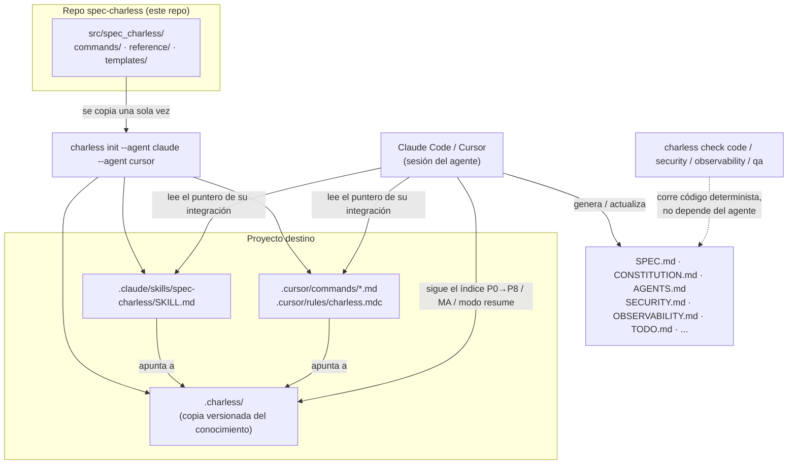

# spec-charless

Toolkit multi-agente para **Spec-Driven Development**, nivel **Spec-Anchored** (el spec es un documento vivo, no una foto del día 1 — ver `src/spec_charless/reference/methodologies.md`).

Nacido como una skill de Claude, ahora es un framework agnóstico de agente: la misma base de conocimiento (`.charless/`) sirve para Claude Code, Cursor, y los agentes que se agreguen — sin duplicar contenido entre ellos.

## Instalación

Requiere **Python 3.9 o superior**. No hace falta clonar el repo ni compilar nada: `pip` sabe instalar directamente desde GitHub.

### Recomendado — como herramienta aislada (`uv` o `pipx`)

Instala `charless` en su propio entorno y lo deja disponible en el PATH, sin ensuciar tu Python del sistema. Mismo comando en **Windows, Linux y macOS**:

```bash
uv tool install git+https://github.com/carlos0718/spec-charless.git
# o, si preferís pipx:
pipx install git+https://github.com/carlos0718/spec-charless.git
```

### Fijar una versión

Sin sufijo, los comandos de arriba instalan la punta de `master`, que puede moverse entre una instalación y otra. Para reproducibilidad, agregá `@` y el tag de la versión:

```bash
uv tool install "git+https://github.com/carlos0718/spec-charless.git@v0.2.0"
```

Las versiones publicadas están en [Releases](https://github.com/carlos0718/spec-charless/releases), con sus notas en el [CHANGELOG](CHANGELOG.md).

### Alternativa — con `pip` en un entorno virtual

<details>
<summary><b>Windows</b> (PowerShell)</summary>

```powershell
py -m venv .venv
.venv\Scripts\Activate.ps1
py -m pip install git+https://github.com/carlos0718/spec-charless.git
```
</details>

<details>
<summary><b>Linux / macOS</b></summary>

```bash
python3 -m venv .venv
source .venv/bin/activate
python3 -m pip install "git+https://github.com/carlos0718/spec-charless.git"
```
</details>

> En Linux y macOS instalar con `pip` fuera de un entorno virtual suele fallar con `externally-managed-environment` — es una protección del sistema operativo, no un error del paquete. Usá `uv`/`pipx` o un venv.

Verificá que quedó bien:

```bash
charless --version
charless list-integrations
```

### Actualizar y desinstalar

```bash
uv tool upgrade spec-charless      # o: pipx upgrade spec-charless
uv tool uninstall spec-charless    # o: pipx uninstall spec-charless
```

Con `pip`, reinstalá agregando `--force-reinstall` al comando de instalación.

### Para desarrollar sobre la herramienta

```bash
git clone https://github.com/carlos0718/spec-charless.git
cd spec-charless
pip install -e ".[dev]"
pytest
```

> **Nota:** todavía no está publicado en PyPI, así que `pip install spec-charless` (sin la URL de git) no funciona. Se instala desde el repo con los comandos de arriba.

## Uso

```bash
# Inicializar un proyecto con uno o más agentes
charless init mi-proyecto --agent claude
charless init mi-proyecto --agent claude --agent cursor

# Ver qué agentes soporta esta versión
charless list-integrations

# Health-checks deterministas (no dependen de que un LLM corra el comando bien)
charless check code .
charless check security .
charless check observability .
charless check qa .
```

### Comandos disponibles

| Comando | Qué hace |
|---|---|
| `charless` | Sin subcomando: muestra el banner de bienvenida (estado del proyecto si ya tiene `.charless/`, o la lista de agentes si es la primera vez) y la ayuda. |
| `charless --version` | Imprime la versión instalada, leída de los metadatos del paquete. |
| `charless init [PATH] --agent <agente>` | Instala el conocimiento compartido (`.charless/`) en `PATH` (default: `.`) y genera la integración de cada `--agent` (repetible: `--agent claude --agent cursor`). |
| `charless init [PATH] --agent <agente> --force` | Igual que arriba, pero regenera `.charless/` aunque ya exista. |
| `charless list-integrations` | Lista los agentes soportados por esta versión (`claude`, `cursor`). |
| `charless check code [PATH]` | Health-check: tamaño de archivo y code smells estructurales. |
| `charless check security [PATH]` | Health-check: `.env` commiteado, secrets hardcodeados, vulnerabilidades conocidas. |
| `charless check observability [PATH]` | Health-check: error tracking, health endpoint, logging estructurado. |
| `charless check qa [PATH]` | Trazabilidad RF → US → RNF → tarea y placeholders sin rellenar. |
| `charless check version [PATH]` | Calcula el bump de SemVer exacto desde el último tag (Conventional Commits, "el más alto gana") y avisa si una rama `feature/*` acumuló demasiados `fix`. |

`PATH` es opcional en todos los `check` — por default corre sobre el directorio actual (`.`).

## Cómo trabaja



**Cómo leerlo**: el conocimiento (`commands/`, `reference/`, `templates/`) vive una sola vez, en este repo. `charless init` lo copia a `.charless/` dentro del proyecto destino y genera un puntero delgado por cada agente elegido — el agente (Claude Code, Cursor) lee ese puntero y de ahí sigue hacia `.charless/`, que es la fuente real de instrucciones. Los `charless check` son código Python determinista que audita los archivos generados (`SPEC.md`, `SECURITY.md`, etc.) directamente, sin pasar por el agente.

## Cómo está armado

```
.charless/              ← se instala en el proyecto DESTINO, no acá
├── commands/            (los pasos del ciclo de vida — spec, arquitectura, seguridad...)
├── reference/           (principios, metodologías, arquitecturas, guías de diseño)
├── templates/           (SPEC.md, CONSTITUTION.md, AGENTS.md, SECURITY.md, etc.)
└── VERSION

src/spec_charless/
├── cli.py                    (comandos: init, check, list-integrations)
├── scaffold.py                (copia el conocimiento a .charless/ del proyecto destino)
├── integrations/
│   ├── base.py                (IntegrationBase — contrato que cumple cada agente)
│   ├── claude.py               (genera .claude/skills/spec-charless/SKILL.md)
│   └── cursor.py                (genera .cursor/commands/*.md + .cursor/rules/charless.mdc)
└── scripts/
    ├── render_template.py       (relleno determinista de {{PLACEHOLDER}})
    ├── health_check.py           (equivalente en código de MA-1.5/1.6/1.7)
    └── qa_review.py               (equivalente en código de P7.5 — trazabilidad RF→US→RNF→tarea)
```

**Principio de diseño**: el conocimiento (`commands/`, `reference/`, `templates/`) es uno solo y vive en `.charless/` dentro del repo del proyecto — versionado junto al código. Cada integración es un adaptador delgado que genera un puntero hacia ahí, en el formato que su agente espera. Agregar un agente nuevo (Windsurf, Copilot) es escribir una integración más, nunca reescribir el conocimiento.

## Agentes soportados

| Agente | Formato generado |
|---|---|
| Claude Code | `.claude/skills/spec-charless/SKILL.md` |
| Cursor | `.cursor/commands/charless-*.md` + `.cursor/rules/charless.mdc` |

## Licencia

MIT — ver [`LICENSE`](./LICENSE).
