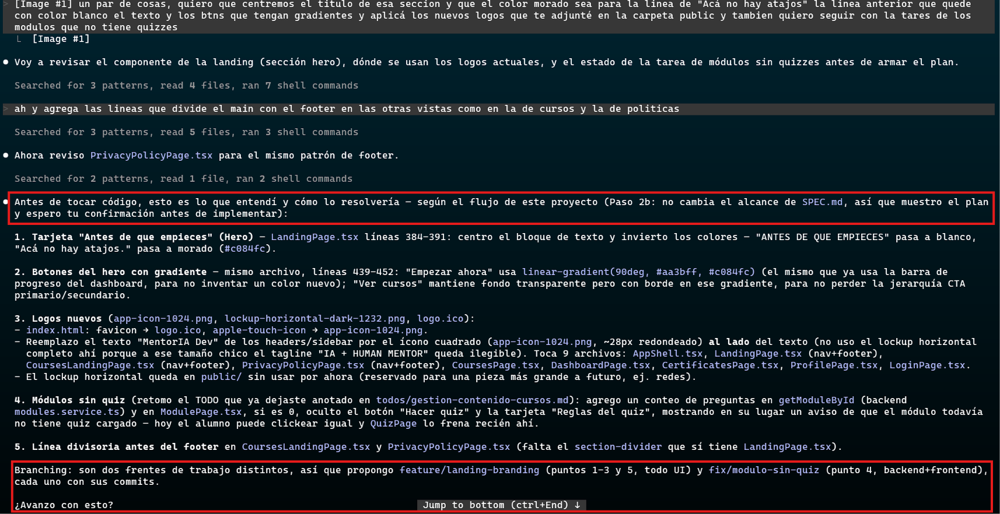
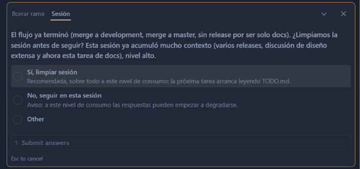

# Cómo es una sesión real, de punta a punta

Este documento no repite lo que ya está en el [README](README.md) (instalación,
comandos, arquitectura del paquete). Es la otra mitad: qué se siente trabajar
con `rocky-spec` instalado en un proyecto — dónde para a preguntar, qué
archivos se actualizan solos, y cómo se ve el flujo de Git en la práctica. No
es un generador de documentación que corre una vez y se desactualiza: es un
colaborador que planifica antes de tocar código y frena en los puntos donde
una decisión es tuya, no suya.

Hay dos formas de empezar — un proyecto en blanco, o uno que ya tiene código
— y cada una tiene su propia sección más abajo. Todo lo que sigue después
(planificación de cambios, GitFlow, trazabilidad) aplica igual a las dos, una
vez que el proyecto ya tiene `.rocky-spec/` instalado.

## Arrancando un proyecto nuevo — las preguntas de P0 a P8

Después de `rocky init --agent claude` (o `cursor`), decirle al agente algo
como *"quiero armar un proyecto nuevo"* dispara una entrevista estructurada,
no un formulario único: 17 pasos (`P0` a `P8.5`, ver la tabla completa en el
[README](README.md#los-17-comandos-del-agente)), cada uno preguntando solo lo
que le corresponde — stack en P3, arquitectura en P4, design system en P4.5,
nivel de seguridad en P5.6, y así. No todos los pasos aplican siempre: una
API sin interfaz visual salta P4.5 (design system) y P5.8 (accesibilidad),
por ejemplo.

Donde hay una decisión con opciones conocidas (tono visual, escala de
seguridad, sí/no a TDD), la pregunta se muestra como menú con default
sugerido, no como texto libre a interpretar — reduce la ambigüedad de la
respuesta y hace más rápido decidir. `SPEC.md`, `AGENTS.md` y el resto de los
archivos base recién se generan al final (P6/P7), con todo lo recolectado en
la entrevista — nunca antes.

## Adoptar un proyecto existente

Si el directorio ya tiene código pero nunca corrió esta skill, el agente
detecta la diferencia solo (no hay `.skill-state.json`) y entra en **Modo
Adopción** en vez del flujo de arriba — la idea no es empezar de cero, es
retro-aplicar las convenciones sobre lo que ya existe.

1. **Escaneo automático** (`package.json`/`requirements.txt`/etc., estructura
   de carpetas, ramas de git) más cuatro health-checks — código (tamaño de
   archivo, code smells), seguridad (`.env` commiteado, secrets hardcodeados,
   vulnerabilidades conocidas), observabilidad (error tracking, logging,
   health endpoint) y accesibilidad si el proyecto tiene interfaz visual.
2. **Te muestra lo que encontró** — stack detectado, hallazgos por categoría
   con su severidad (🔴/🟡), y qué archivos de la skill ya existen — y pide
   **solo** los tres datos que no se pueden inferir del código: de qué trata
   el proyecto, qué tipo es, y si tiene backend/DB. Si un archivo como
   `README.md` ya tiene una descripción, la reusa en vez de preguntar de
   nuevo.
3. Arma `SPEC.md`, el dominio y la arquitectura **a partir de lo que ya está
   escrito**, no de cero.
4. **Genera solo lo que falta.** La regla no tiene excepción: nunca
   sobreescribe un archivo que ya existe salvo que se lo confirmes vos
   explícitamente — `README.md`, convenciones propias, todo lo que ya tenías
   se respeta.
5. El `TODO.md` que arma **refleja el estado real**: lo que el código ya
   hace aparece marcado `- [x]` desde el día uno, no en blanco esperando que
   lo vuelvas a hacer.
6. Termina con el mismo reporte de cierre que el flujo de creación — qué se
   generó, qué quedó pendiente, y cómo seguir (*"continuemos"*, *"qué
   sigue"*).

## Planificación — nada se toca sin plan ni confirmación

Antes de que se escriba una sola línea de código o de `SPEC.md`, cualquier
pedido (feature nueva o corrección) pasa por esto:

1. **¿Cambia el alcance de `SPEC.md`?**
   - **Sí** (ej. *"quiero agregar login con Google"*) → primero se escriben
     `RF-N` (la feature, en la tabla de prioridades P0/P1/P2), las `US-N`
     que la implementan (cada una etiquetada `(implementa RF-N)`), y si
     corresponde un `RNF-N` (ej. *"el login responde en menos de 300ms"*) —
     todo en `SPEC.md`, con su línea en "Historial de cambios". Recién
     después se muestra el plan técnico: qué archivos, en qué orden
     (Dominio/DB → API → Frontend, o por feature), **y qué rama se va a
     crear** (`feature/google-auth`).
   - **No** (una corrección puntual) → se describe el cambio en 3-5 líneas,
     sin tocar `SPEC.md`, con la rama que correspondería (`fix/<algo>`).
2. En los dos casos, el plan termina con una pregunta explícita — *"¿Avanzo
   con esto?"* — y se espera la respuesta. Nunca se adelanta código en el
   mismo turno en que se recibe el pedido, aunque el pedido ya se haya
   entendido del todo.
3. Recién con la confirmación arranca la implementación — que es donde entra
   todo lo de la sección siguiente.

Este mismo archivo es un ejemplo real del mecanismo, no uno armado para la
ocasión: se mostró un plan de estructura, el usuario pidió dos ajustes (sumar
esta sección y la de capturas del final) antes de aprobar nada, y solo
después de la confirmación se creó la rama y se escribió el contenido.

## GitFlow, paso a paso

Con la confirmación en mano, así se ve una tarea de punta a punta:

1. **Antes de commitear**, tres chequeos corren solos: ¿el diff agrega algo
   que no está en `SPEC.md`? ¿la rama actual es `master`/`development` en vez
   de una propia? ¿el commit es `feat`/`fix` y no tocó `TODO.md`? Cualquiera
   de los tres avisa antes de seguir, no bloquea en silencio.
2. **Commit local**: el checkbox de `TODO.md` (`- [ ]` → `- [x]`), el código,
   y la línea de `CHANGELOG.md` (si el tipo del commit entra al changelog)
   viajan **siempre juntos**, con el formato
   `<tipo>: <descripción> (TODO: <texto exacto de la tarea>)`.
3. **Antes del `push`** — pausa explícita, siempre, sin importar el tamaño
   del cambio: se muestra un resumen (qué se hizo, qué archivos, resultado de
   tests) y se pregunta con opciones cerradas — Sí/No por rama, nunca una
   frase libre en el chat.
4. Push.
5. **Antes del `merge`** (`feature/*`/`fix/*` → `development`, o
   `development` → `master` en un release) — la misma pausa, el mismo
   mecanismo. Nunca se encadena commit → push → merge sin que el humano vea
   qué se está por integrar.
6. **Al mergear a `development`**: se corre el cálculo de versión —
   Conventional Commits, "el más alto gana" (MAJOR > MINOR > PATCH, nunca se
   apilan) — y se pregunta si taguear ahora o dejarlo para cuando se junten
   más cambios. Nunca se taguea sin que lo pidas.
7. **Si se decide el release**: mover `[Unreleased]` del changelog a la
   versión, actualizar el archivo de versión del paquete, commit
   `chore(release)`, tag, push del tag, publicar el Release, merge a la rama
   principal, y un chequeo de que esa rama quedó con el número correcto (no
   solo el tag).
8. **Cierre**: se listan las ramas ya mergeadas y se pregunta cuáles borrar,
   y se ofrece limpiar la sesión — el estado del trabajo vive en los
   archivos, no en la conversación.

Esto no es teórico: es exactamente lo que pasó en este mismo repo al cerrar
sus últimas dos versiones — se puede seguir en `git log --oneline` y en
`CHANGELOG.md`.

## `AskUserQuestion` — qué es y en qué momentos aparece

Es una confirmación con **opciones cerradas** (ej. "Sí, pushear" / "No,
todavía no"), no una pregunta abierta que se responde con un "dale" suelto en
el chat. La razón: una frase libre no distingue entre aprobar *solo* el push
y aprobar además el tag y el merge que suelen venir después — las opciones
cerradas sí. Aparece en puntos concretos, siempre los mismos:

- Antes de crear una rama nueva, cuando el plan lo requiere.
- Antes de cualquier `git push`.
- Antes de cualquier `git merge` (en cualquiera de los dos sentidos).
- Al decidir si se taguea una versión.
- Al borrar ramas ya mergeadas.
- Al ofrecer limpiar la sesión una vez cerrado el flujo.

En Claude Code, además, estas cuatro acciones (`push`, `merge`, `tag`, borrar
rama) quedan agregadas a `permissions.ask` de `.claude/settings.json` al
correr `rocky init --agent claude` — la regla no depende solo de que el
agente se acuerde de preguntar, Claude Code la exige aunque se olvide.

## TODO único vs. orquestador (`todos/`)

Un proyecto chico usa un solo `TODO.md`. Uno fullstack activo, o con
arquitectura Grande (Clean/Hexagonal), o de equipo/largo plazo, divide desde
el arranque en una carpeta `todos/` — un archivo por capa
(`dominio-db.md`, `api-backend.md`, `frontend-ui.md`) o por feature
(`login.md`, `checkout.md`), según cómo prefiera trabajar el equipo. En ese
modo, `TODO.md` pasa a ser un orquestador: conserva Setup/Calidad/Documentación
inline y agrega una tabla "Estado por grupo" con el progreso de cada archivo,
que se actualiza solo cuando se completa la **última tarea de un grupo
entero** — no en cada commit individual.

## Trazabilidad RF → US → RNF → tarea

`SPEC.md` numera tres tipos de requisito: `RF-N` (una feature), `US-N` (una
historia de usuario, que declara qué `RF-N` implementa), `RNF-N` (un
requisito no funcional, como performance o accesibilidad). Cada tarea del
TODO que resuelve una historia termina con su ID entre paréntesis —
`- [ ] Endpoint POST /login (US-1)`. Esto no es solo convención: `rocky check
qa` recorre la cadena completa y avisa si algo quedó suelto — un `RF-N` sin
ninguna `US-N` que lo implemente, una `US-N` sin ninguna tarea en el TODO, o
un `RNF-N` con un objetivo concreto (no el default) pero sin ningún trabajo
que lo aborde. Es código, no un LLM releyendo `SPEC.md` cada vez con la
esperanza de no saltearse nada.

## Otros checks deterministas

Los mismos que agrupa `rocky check` — tamaño de archivo y code smells,
secrets hardcodeados, error tracking y health endpoint, criterios básicos de
accesibilidad, y el cálculo de versión ya mencionado arriba. Corren como
código Python, no como instrucciones que un agente interpreta de nuevo en
cada sesión — el detalle completo de cada uno está en la tabla de comandos
del [README](README.md#health-checks-rocky-check).

## Capturas pendientes

Las imágenes de arriba están referenciadas por nombre de archivo; en cuanto
se agreguen a `assets/` con esos nombres, se ven solas, sin tocar este
documento de nuevo. Un video no se reproduce inline poniéndolo en `assets/`
—GitHub solo embebe video subido a través de su propio editor web (drag &
drop en un PR/comentario), no un archivo referenciado por ruta relativa—, así
que para una secuencia de varios pasos (como la entrevista P0→P8) conviene un
GIF corto en vez de un `.mp4` commiteado.

| Archivo | Qué debería mostrar | Sección | Estado |
|---|---|---|---|
| `assets/usage-onboarding-question.png` | Una pregunta con menú durante el armado inicial (ej. tono visual de P4.5, o escala de seguridad de P5.6) | Arrancando un proyecto nuevo | Pendiente |
| `assets/usage-adoption-scan.png` | Pantalla de MA-2 con los hallazgos del escaneo automático + el pedido de los 3 datos que no se infieren | Adoptar un proyecto existente | Pendiente |
| `assets/usage-plan-questions.png` | Plan de una tarea + pregunta antes de tocar código | Planificación | ✅ En `assets/` |
| `assets/usage-push-confirm.png` | `AskUserQuestion` confirmando un `git push` | GitFlow | Pendiente |
| `assets/usage-merge-confirm.png` | `AskUserQuestion` confirmando un `git merge` | GitFlow | Pendiente |
| `assets/usage-version-check.png` | Salida de `rocky check version` + la pregunta de taguear | GitFlow | Pendiente |
| `assets/usage-branch-cleanup.png` | `AskUserQuestion` preguntando qué ramas borrar | GitFlow | ✅ En `assets/` |
| `assets/usage-session-cleanup.png` | `AskUserQuestion` ofreciendo limpiar la sesión | GitFlow | ✅ En `assets/` |
| `assets/usage-todo-orchestrator.png` | Estructura de carpeta `todos/` en el explorador de archivos | TODO orquestador | Pendiente |
