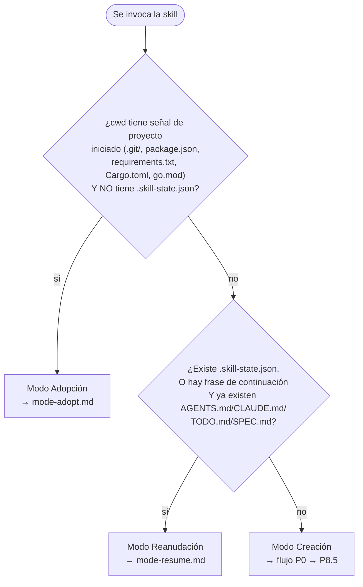
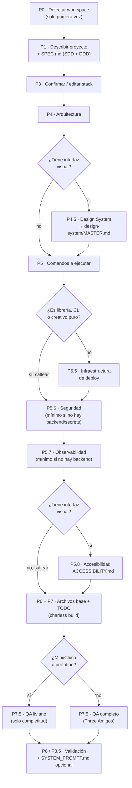
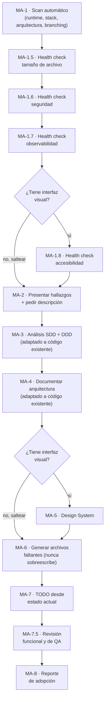
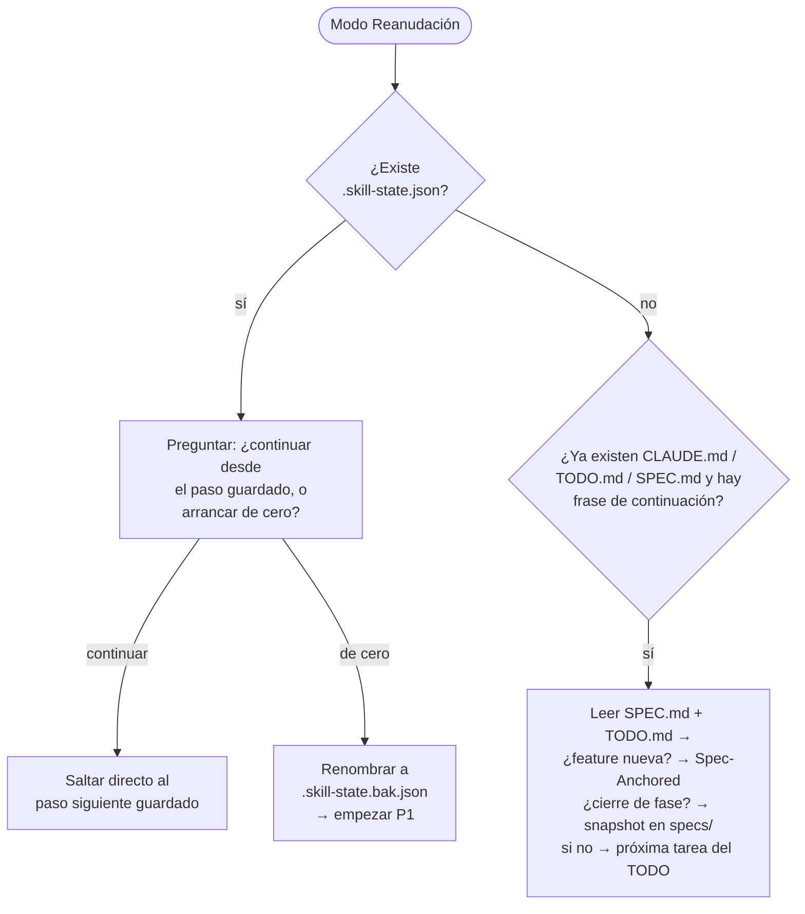

# Diagrama de flujo — cómo itera la skill

> Referencia visual de `charless-ia`. No agrega reglas nuevas — es un mapa de los pasos y condicionales que ya están descriptos en `commands/*.md`, para ver de un vistazo cómo se conectan sin tener que leer los 14 archivos. Si algo acá contradice a un `commands/*.md`, ese archivo es la fuente de verdad, no este diagrama.

## 1 · Detección de modo (el router)

Lo primero que corre siempre, antes de cualquier otro paso — decide cuál de los tres modos sigue.

## 2 · Modo Creación (P0 → P8.5)

Orden real de `scaffold.py` (`COMMAND_CATALOG`), con los condicionales tal como están escritos en cada `commands/*.md` (`**Saltear si:**`).

**Notas de los condicionales** (no repetir la letra chica de cada `commands/*.md`, solo la señal):
- `P4.5`/`P5.8` — condición idéntica ("¿tiene interfaz visual?"), pero distinto comportamiento sin ella: `P4.5` simplemente no corre; `P5.8` tampoco genera nada mínimo (a diferencia de `P5.6`/`P5.7`, que sí generan una versión chica igual).
- `P5.5` — se saltea directo a `P5.6` si es librería/CLI/creativo puro.
- `P5.6`/`P5.7` — nunca se saltean del todo: sin backend, generan la versión mínima del archivo (política de reporte de vulnerabilidades / logging del build).
- `P7.5` — no se saltea, se aliviana (Mini/Chico o prototipo → solo el paso mecánico de completitud).

## 3 · Modo Adopción (MA-1 → MA-8)

Cada `MA-1.x` de la izquierda alimenta directamente una fila de la tabla `MA-6` (`SECURITY.md`, `OBSERVABILITY.md`, `ACCESSIBILITY.md`) — los ítems con hallazgo arrancan sin marcar en el checklist, nunca asumidos como resueltos.

## 4 · Modo Reanudación

## Cómo se conectan los tres diagramas de arriba con el código Python

Ninguno de estos pasos es código — son instrucciones en `.md` que el LLM sigue conversando. Lo único determinista en toda esta cadena son los `charless check *`/`charless build` que algunos pasos invocan (`MA-1.5`–`MA-1.8`, y `P4.5`/`P5.8` al generar `MASTER.md`/`ACCESSIBILITY.md`) — ver el diagrama de arquitectura en el [`README.md`](../../../README.md) del paquete para esa otra mitad del sistema (`init`/`.charless/`/integraciones).
